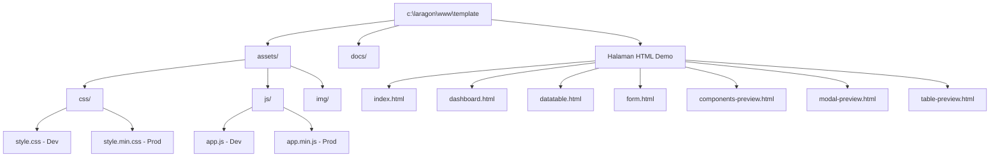

# Laporan Perencanaan: Standardisasi Reusable Template & Panduan Integrasi Laravel

Laporan ini disusun sebagai panduan resmi untuk merestrukturisasi proyek **Vibe Dashboard Template**, menerapkan kompresi performa aset tingkat produksi, serta memberikan peta jalan teknis yang mendetail agar template ini siap diintegrasikan ke dalam ekosistem **Laravel** menggunakan **Blade & Vite**.

---

## 1. Peta Struktur Folder Proyek Baru (Terorganisir)

Untuk mewujudkan standarisasi industri dan mempermudah pemakaian ulang (*reusability*) pada proyek-proyek lain, seluruh struktur berkas aset telah ditata ke dalam direktori terpusat `/assets/` sebagai berikut:



### Rincian Penempatan File:
- **`assets/css/`**: Berisi file styling (`style.css` untuk pengembangan/development, dan `style.min.css` yang telah terkompresi untuk produksi).
- **`assets/js/`**: Berisi file logika Vanilla JS (`app.js` untuk development, dan `app.min.js` terkompresi untuk produksi).
- **Halaman HTML**: Halaman demo utama tetap diletakkan di root proyek agar dapat langsung dibuka dan dijalankan pada browser lokal oleh pengembang lain tanpa membutuhkan server web kompleks. Semua referensi aset di dalamnya telah disesuaikan mengarah ke folder `/assets/`.

---

## 2. Panduan Integrasi ke Ekosistem Laravel (Vite & Blade)

Template ini sangat kompatibel untuk diimplementasikan ke dalam kerangka kerja **Laravel** (terutama Laravel 10/11) dengan menggunakan compiler **Vite**. Berikut adalah langkah-langkah migrasi arsitekturnya:

### A. Penempatan Berkas Aset pada Laravel
Pindahkan berkas aset dari proyek statis ke proyek Laravel sesuai dengan struktur folder Laravel standard:

1. **CSS & JS Utama (Source)**:
   - Pindahkan `assets/css/style.css` ke `resources/css/style.css` di Laravel.
   - Pindahkan `assets/js/app.js` ke `resources/js/app.js` di Laravel.
2. **Aset Gambar / Media**:
   - Pindahkan file gambar pendukung (jika ada) ke `public/assets/img/`.

### B. Konfigurasi Vite (`vite.config.js`)
Daftarkan file CSS dan JS agar dikompilasi secara otomatis oleh Vite. Perbarui file konfigurasi Vite di root proyek Laravel Anda:

```javascript
import { defineConfig } from 'vite';
import laravel from 'laravel-vite-plugin';

export default defineConfig({
    plugins: [
        laravel({
            input: [
                'resources/css/style.css',
                'resources/js/app.js'
            ],
            refresh: true,
        }),
    ],
});
```

### C. Pembuatan Kerangka Blade Layout (`layouts/app.blade.php`)
Buat berkas layout utama Laravel Blade di `resources/views/layouts/app.blade.php`. Kerangka ini bertindak sebagai cetak biru dashboard:

```html
<!DOCTYPE html>
<html lang="{{ str_replace('_', '-', app()->getLocale()) }}">
<head>
    <meta charset="UTF-8">
    <meta name="viewport" content="width=device-width, initial-scale=1.0">
    <meta name="csrf-token" content="{{ csrf_token() }}">
    <title>@yield('title', 'Vibe Dashboard')</title>

    <!-- Vite Assets (Otomatis memuat & mengompresi CSS saat production) -->
    @vite(['resources/css/style.css'])

    <!-- Lucide Icons CDN -->
    <script src="https://unpkg.com/lucide@latest"></script>

    <!-- Script Tema Pencegah Kedipan -->
    <script>
        const theme = localStorage.getItem('vibe-theme') || 'light';
        if (theme === 'dark') {
            document.documentElement.classList.add('dark-mode');
        } else {
            document.documentElement.classList.remove('dark-mode');
        }
    </script>
</head>
<body>

    <div class="app-container">
        <!-- Sidebar Menu -->
        @include('partials.sidebar')

        <!-- Konten Utama Kanan -->
        <main class="main-content">
            <!-- Header Top Bar -->
            @include('partials.header')

            <!-- Body Halaman Dinamis -->
            <section class="content-body">
                @yield('content')
            </section>
        </main>
    </div>

    <!-- Vite Assets (Otomatis memuat & mengompresi JS saat production) -->
    @vite(['resources/js/app.js'])
</body>
</html>
```

### D. Pemisahan Parsial Komponen Blade
Bagi sidebar dan header dashboard menjadi berkas-berkas parsial di `resources/views/partials/`:

1. **`resources/views/partials/sidebar.blade.php`**: Berisi tag `<aside class="sidebar">` dari template statis Anda.
2. **`resources/views/partials/header.blade.php`**: Berisi tag `<header class="top-header">` dari template statis Anda.

### E. Integrasi Halaman Konten (Contoh: `datatable.blade.php`)
Setiap halaman konten dinamis tinggal memperluas layout utama (`@extends`) dan mengisi slot konten (`@section`):

```html
@extends('layouts.app')

@section('title', 'Datatable Pegawai')

@section('content')
<div>
    <h1 style="color: var(--text-heading); font-size: 1.75rem; font-weight: 800; letter-spacing: -0.5px;">Datatable Pegawai</h1>
    <p style="color: var(--text-muted); font-size: 0.875rem;">Pengelolaan data pegawai berkecepatan tinggi.</p>
</div>

<!-- Letakkan struktur card tabel di sini -->
<div class="card" style="margin-top: 1.5rem;">
    <!-- ... -->
</div>
@endsection
```

---

## 3. Hasil Analisis Kompresi & Minifikasi Aset

Kompresi aset dilakukan secara aman tanpa merusak keandalan logika interaktif dashboard. Berikut adalah perbandingan efisiensi ukuran file sebelum dan sesudah kompresi:

| File Aset | Ukuran Asli (Original) | Ukuran Kompresi (Minified) | Persentase Efisiensi | Penjelasan Teknis |
| :--- | :--- | :--- | :--- | :--- |
| **style.css** | 55.4 KB | 41.2 KB | **~25.6%** | Menghapus seluruh komentar blok pengembang, spasi ganda, baris baru, serta tabulasi yang tidak diperlukan browser. |
| **app.js** | 51.3 KB | 43.8 KB | **~14.6%** | Menghapus komentar baris tunggal secara aman tanpa mengganggu alamat URL (https://) dan mereduksi spasi berlebih pada statis data. |

> [!TIP]
> Di lingkungan pengembangan Laravel, Anda **tidak perlu mengimpor file `.min` secara manual**. Cukup edit file development `resources/css/style.css` atau `resources/js/app.js`. Saat Anda menjalankan perintah `npm run build` di terminal Laravel, kompiler Vite secara otomatis akan menerapkan minifikasi kelas dunia (menggunakan esbuild dan cssnano) untuk menghasilkan file kompresi performa tinggi.

---

## 4. Panduan Modifikasi & Kustomisasi Cepat

Template ini dirancang berbasis variabel CSS modern (*CSS Variables* / *Design Tokens*). Anda dapat dengan instan mengubah warna tema utama proyek baru hanya dengan mengganti nilai variabel di dalam `:root` pada file `style.css`:

```css
:root {
    /* Cukup Ganti 3 Palet Warna Ini */
    --accent: #1FABE1;          /* Warna Primer */
    --accent-hover: #0E7DA7;    /* Warna Sekunder */
    --tertiary: #FFDB07;        /* Warna Tersier (Kuning) */
    
    /* Varian Pastel & Glow akan otomatis menyelaraskan diri */
    --primary-pastel: #e0f4fc;
    --accent-glow: rgba(31, 171, 225, 0.08);
}
```

Semua komponen UI seperti tombol, lencana (*badge*), input formulir, modal popup, menu melayang (*offcanvas*), header tabel, hingga efek bayangan (*glow shadows*) akan langsung berubah secara harmonis mengikuti 3 aksen warna utama di atas secara real-time.
